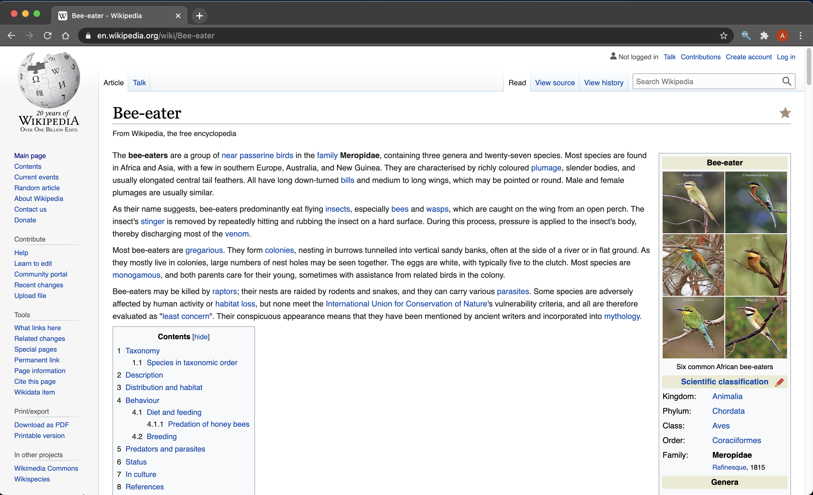
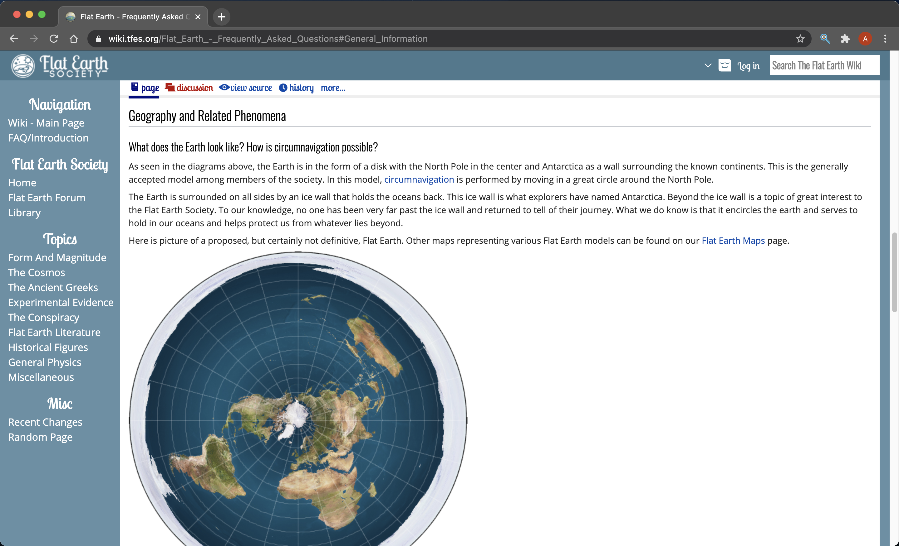
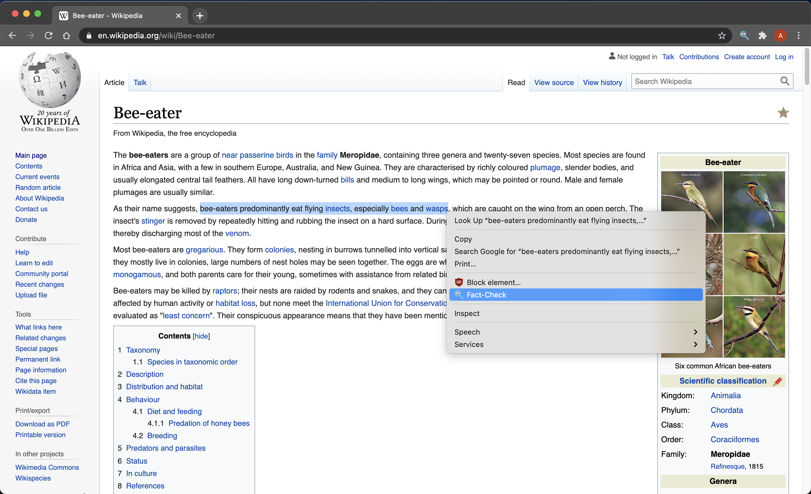
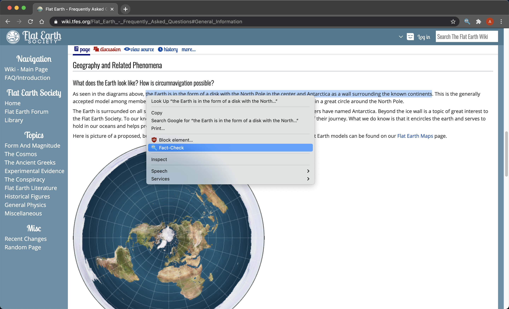
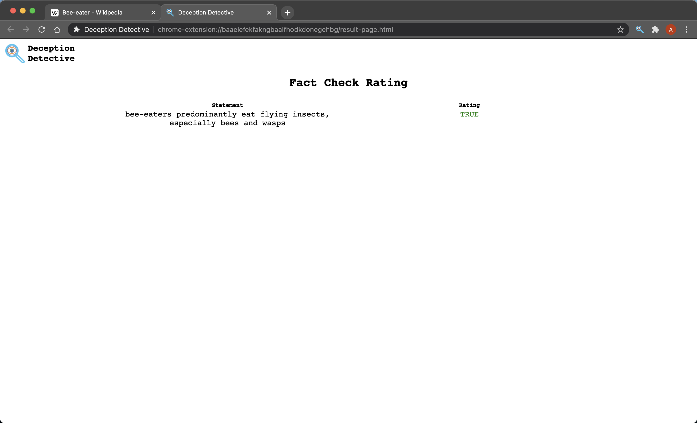
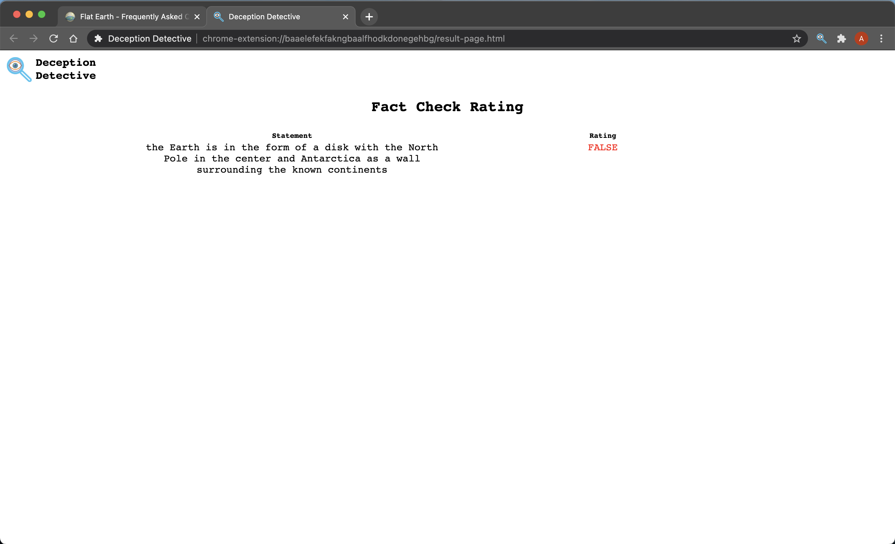

# Chrome Extension Usage

This guide will demonstrate the usage of the Deception Detective Chrome extension by fact checking true and false statements found on the Internet.

***Result Page is a Work in Progress and not representative of the final product***

1) Navigate the web page containing the statement you intend to fact check
 
   
   
   
2) Highlight text, *right-click* and select the *Fact-Check* context menu option
 
   
   

3) Fact ratings will be shown in a new tab
 
   
   
