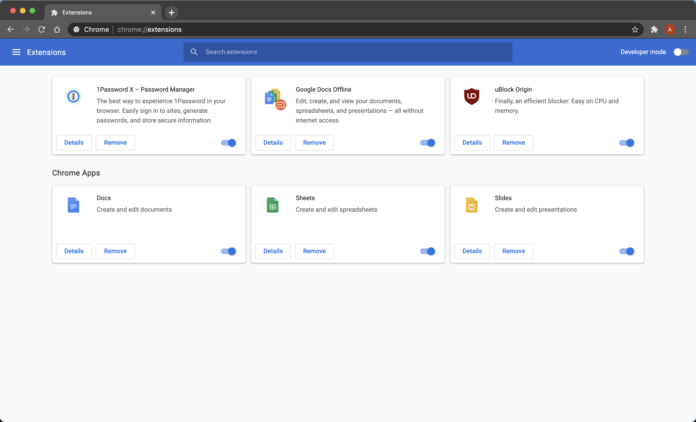
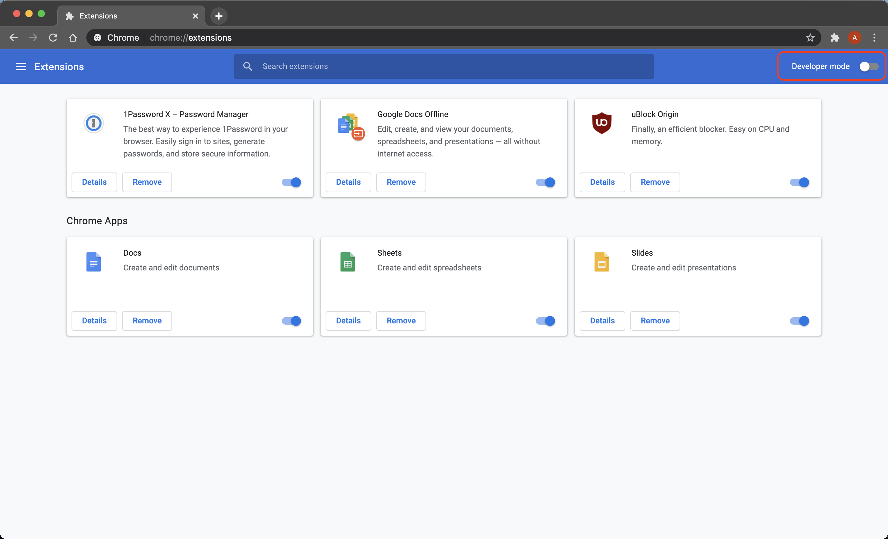
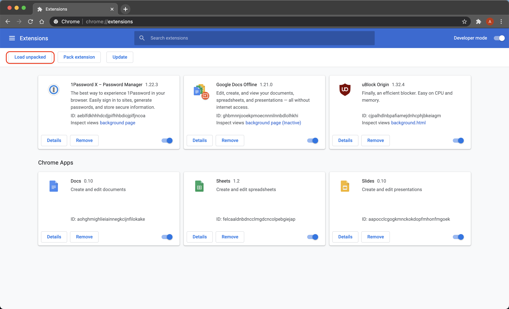
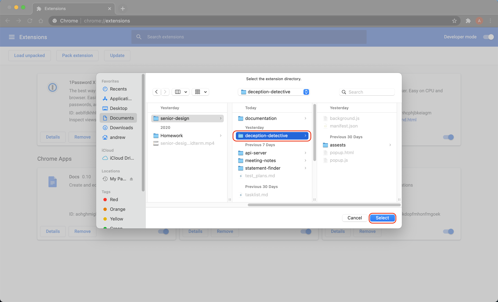
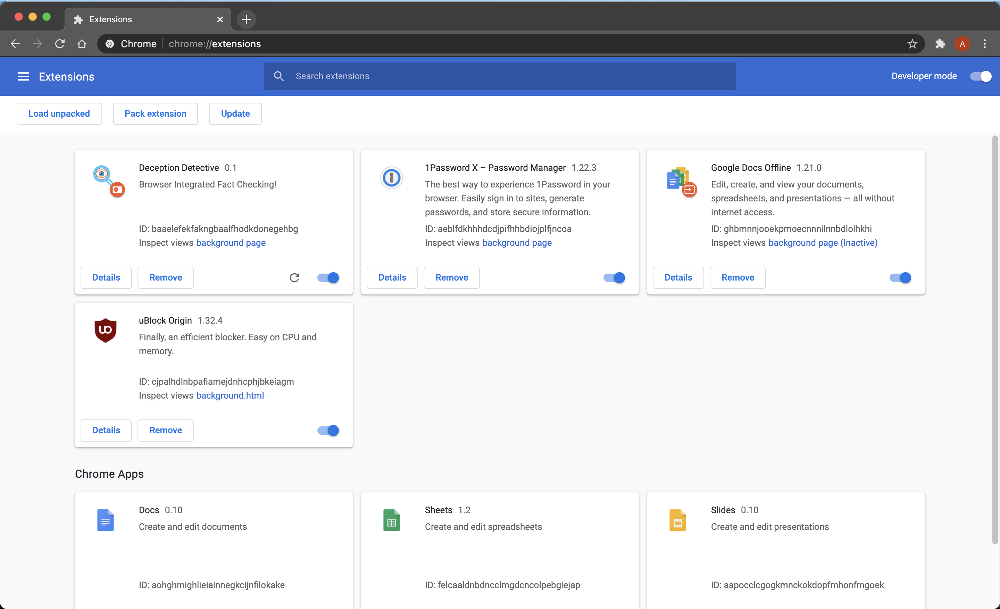

# Install Chrome Extension

This guide will demonstrate how to install the Deception Detective Chrome extension as an unpacked project.

1) Navigate to [chrome://extensions](chrome://extensions/) in a Chrome browser window
 
   
   
2) Enable *Developer Mode*
 
   

3) Select *Load Unpacked*
 
   

4) Select the directory containing the Deception Detective Chrome extension code. In this repository, that directory is *deception-detective*.
 
   

5) Deception Detective Chrome extension is now installed.
 
   