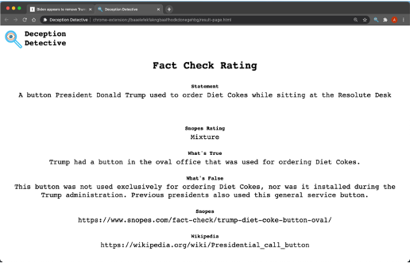

# User Interface Specification

User highlights and right clicks text, then selects the fact-check context menu option.

After fact-checking the selected text, the following rating page is displayed in a new Google Chrome tab.

This rating page includes the following information:

- Statement that was fact-checked
- Snopes Rating (if available)
- What's true (as determined by Snopes, if available)
- What's false (as determined by Snopes, if available)
- Applicable Snopes link
- Applicable Wikipedia link

